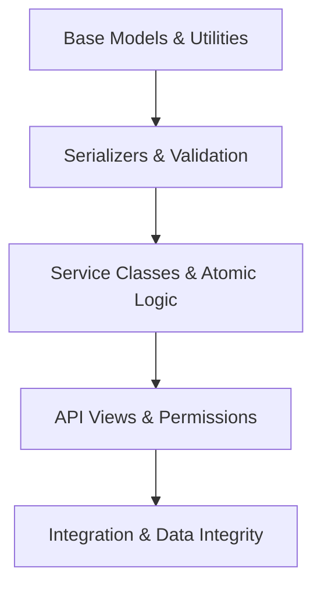
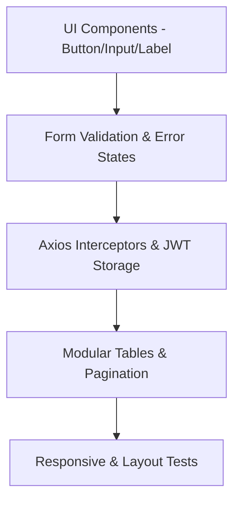

# 🧪 TESTING STANDARDS SKILL

Hướng dẫn chuẩn hóa quy trình kiểm thử (Quality Assurance) dành cho AI Agent. Tài liệu này quy định việc kiểm thử độc lập và nhỏ lẻ từng tác vụ (granular testing) dựa trên tiến độ thực tế trong `FRONTEND_ADMIN_CHECKLIST.md` và `BACKEND_CHECKLIST.md`.

---

# 1. Triết Lý Kiểm Thử Độc Lập & Nhỏ Lẻ (Granular Testing)

*   **Không gom cụm**: Tuyệt đối không kiểm thử chung chung toàn bộ hệ thống sau khi viết xong. Phải kiểm thử từng module nhỏ ngay sau khi hoàn thành.
*   **Chia tách rõ ràng**:
    *   **Backend Testing**: Độc lập hoàn toàn với giao diện. Chạy qua Pytest/Django TestCase trên database test riêng.
    *   **Frontend Testing**: Độc lập hoàn toàn với server thật. Sử dụng Vitest + Mock API (MSW/Axios Mock Adapter) để giả lập dữ liệu.
*   **Kiểm thử bám sát Checklist**: Mỗi đầu việc (checkbox `[ ]`) trong `BACKEND_CHECKLIST.md` và `FRONTEND_ADMIN_CHECKLIST.md` khi chuyển trạng thái sang hoàn thành (`[x]`) phải đi kèm tối thiểu 1 kịch bản kiểm thử tương ứng.

---

# 2. Tiêu Chuẩn Kiểm Thử Backend (Backend QA)

Sử dụng **Pytest** và **Django TestCase**. Kiểm thử theo từng bước nhỏ lẻ:

### Kịch bản chi tiết theo tiến độ `BACKEND_CHECKLIST.md`:

#### 1. Khởi tạo & Nền tảng (Common/Core)
*   **Base Models (`TimestampedModel`, `SoftDeleteModel`)**:
    *   Test tự động điền `created_at` và `updated_at`.
    *   Test phương thức `delete()` không xóa cứng mà chuyển `is_deleted = True`.
*   **Script Seed Data**:
    *   Test chạy script không tạo ra bản ghi trùng lặp và không gây lỗi crash database.

#### 2. Người dùng & Phân quyền (User)
*   **Custom User Model**:
    *   Test tạo user mới bằng Email thay cho Username.
    *   Test kiểm tra các trường số dư (`balance`) mặc định bằng 0 và trường vai trò (`role`).
*   **API Authentication & JWT**:
    *   Test nhập sai mật khẩu trả về status code `401 Unauthorized`.
    *   Test JWT token chứa đúng payload (user_id, email, role).
    *   Test đổi mật khẩu cũ thành công / thất bại.

#### 3. Danh mục Game (Game)
*   **Public & Admin CRUD API**:
    *   Test lấy danh sách game chỉ trả ra những game có trạng thái `ACTIVE`.
    *   Test phân quyền: Chỉ tài khoản Admin mới được thực hiện CRUD danh mục game.

#### 4. Quản lý Tài khoản (Account)
*   **JSONB Dynamic Fields**:
    *   Test validation dữ liệu JSON nhập vào (ví dụ: rank, skin phải đúng cấu trúc schema yêu cầu).
*   **Image Gallery**:
    *   Test thêm nhiều ảnh cho một Account và tự động gắn link chính xác.

#### 5. Thanh toán & Giao dịch (Payment/Transaction)
*   **Atomic updates (`update_user_balance`)**:
    *   Test concurrency (đồng thời nạp/rút) xem số dư có bị sai lệch không.
    *   Test rollback: Nếu một tác vụ ghi log giao dịch thất bại, số dư của user phải được hồi trả về trạng thái cũ (Atomic).
*   **API Admin Approval**:
    *   Test duyệt nạp tiền: Trạng thái đơn nạp đổi sang `COMPLETED`, số dư user tăng tương ứng.

#### 6. Đơn hàng (Order)
*   **Atomic purchase (`purchase_account`)**:
    *   Test mua acc: Trạng thái tài khoản đổi sang `SOLD`, tạo mới đơn hàng, số dư user bị trừ.
    *   Test ngoại lệ: Số dư không đủ -> Giao dịch thất bại, tài khoản vẫn ở trạng thái `ACTIVE`.

---

# 3. Tiêu Chuẩn Kiểm Thử Frontend (Frontend QA)

Sử dụng **Vitest** + **React Testing Library**. Kiểm thử nhỏ lẻ theo giao diện:

### Kịch bản chi tiết theo tiến độ `FRONTEND_ADMIN_CHECKLIST.md`:

#### 1. Nền tảng UI & Cấu trúc (Infrastructure)
*   **Layout & Sidebar**:
    *   Test click các menu item trên Sidebar chuyển hướng route chính xác.
    *   Test Responsive: Trên mobile, Sidebar tự động thu nhỏ hoặc ẩn vào Drawer.
*   **Axios JWT Interceptors**:
    *   Test tự động đính kèm `Authorization: Bearer <token>` vào request header.
    *   Test tự động chuyển hướng về trang `/login` nếu API trả về mã lỗi `401` (hết hạn token).

#### 2. Xác thực (AuthLoginForm & AuthRegisterForm)
*   **LoginForm & RegisterForm**:
    *   Test validate form khi submit trống (hiển thị thông báo lỗi tương ứng bên dưới input).
    *   Test trạng thái Loading: Nút bấm hiển thị `Loader2` spin và bị disable khi đang gửi request.
    *   Test hiển thị `Alert` thông báo lỗi từ server gửi về (ví dụ: "Sai tài khoản hoặc mật khẩu").

#### 3. Bảng dữ liệu & Phân trang (Modular Tables & Pagination)
*   **Table Render & State**:
    *   Test render đúng số lượng dòng trả về từ API.
    *   Test hiển thị `Skeleton` hoặc `Loader` khi đang fetch dữ liệu.
*   **Pagination (PaginationIconsOnly)**:
    *   Test click nút "Next/Previous" gọi API fetch trang tiếp theo kèm query `page` tương ứng.
    *   Test chọn "Rows per page" (ví dụ chọn 20, 50) gọi lại API với query `limit` hoặc `pageSize` tương ứng.

---

# 4. Quy Trình Phê Duyệt Thay Đổi (Zero-Regression Flow)

Khi AI Agent sửa bất kỳ tính năng hoặc UI component nào:

1.  **Chạy kiểm thử riêng lẻ (Unit Test)**: Đảm bảo component/hàm đó tự chạy đúng.
2.  **Verify UI & Responsive**: Mở rộng/co hẹp màn hình để chắc chắn giao diện không bị vỡ.
3.  **Báo cáo Tiến Độ**: Cập nhật trạng thái check tương ứng trong `FRONTEND_ADMIN_CHECKLIST.md` và `BACKEND_CHECKLIST.md`.
4.  **Bàn giao**: Mô tả ngắn gọn cách chạy và kết quả của các bài test đã thực hiện thành công bằng Tiếng Việt.
